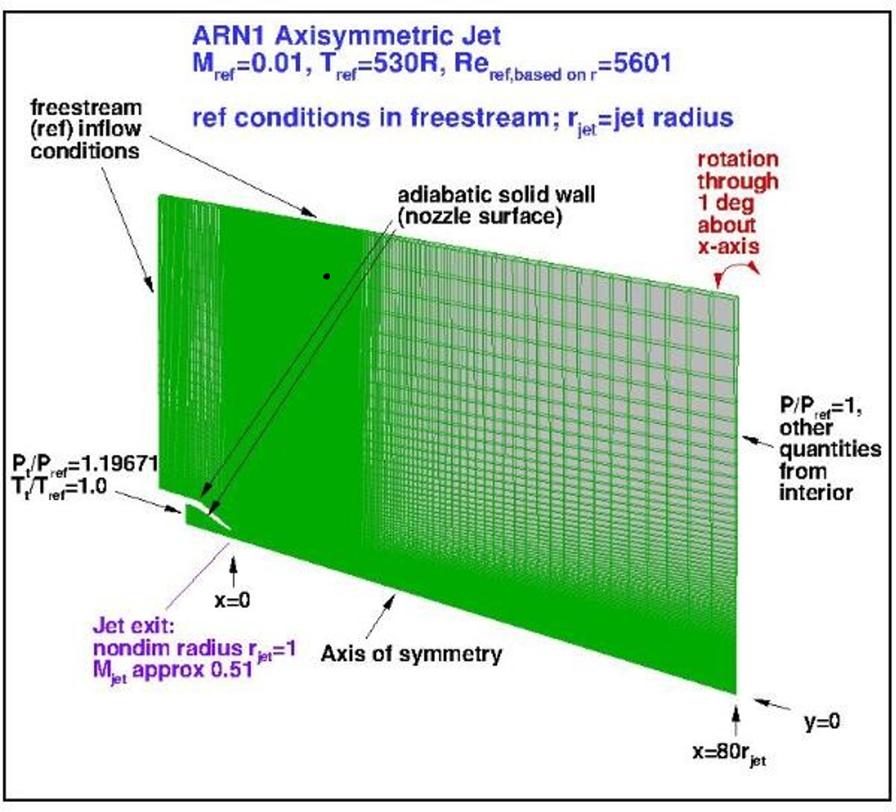
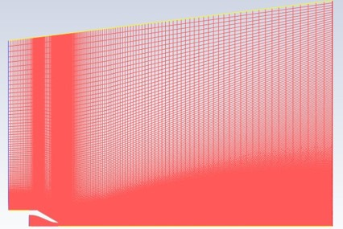
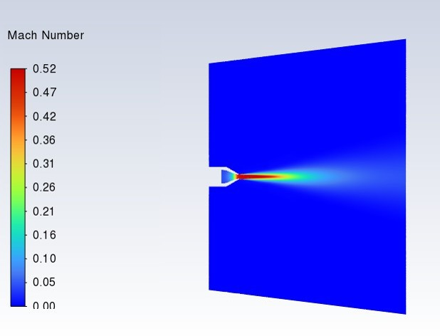
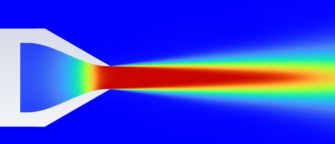
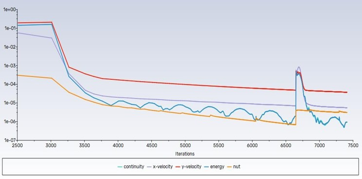
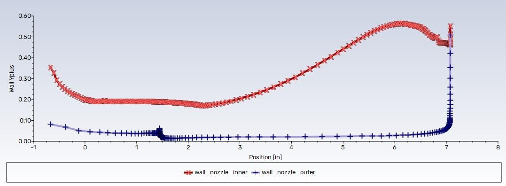

# CFD Study & Validation of Compressible Flow in Converging Nozzle (ARN2 Nozzle)

**Author:** Prashant Kamble  
**Field:** Computational Fluid Dynamics (CFD), Aeroacoustics  
**Software:** ANSYS DesignModeler, ANSYS Meshing, ANSYS Fluent

---

## 1. Project Overview
This repository contains a comprehensive numerical simulation, validation study, and grid convergence analysis of compressible subsonic flow exiting the GRC **Acoustic Reference Nozzle 2 (ARN2)**. The numerical predictions of two widely-used turbulence models (Spalart-Allmaras and Menter SST $k$-$\omega$) are validated against experimental Particle Image Velocimetry (PIV) data and reference CFD results from the **NASA Turbulence Modeling Resource (TMR)**.

---

## 2. Problem Description & Parameters
The physical setup consists of a circular, converging nozzle discharging a subsonic jet into quiescent ambient air.

### Geometric Configuration
* **Nozzle Exit Diameter ($D_j$):** $2.0\text{ inches}$ ($50.8\text{ mm}$)
* **Reference Nozzle Radius ($R_{ref}$):** $1.0\text{ inch}$ ($25.4\text{ mm}$)
* **Computational Domain:** Extends $-12.5\text{ inches}$ upstream of the nozzle exit to $80\text{ inches}$ ($40 D_j$) downstream, with a radial boundary extending $50\text{ inches}$ to model free-jet expansion.

  

### Fluid Properties & Flow Conditions
* **Working Fluid:** Air (Ideal Gas, dynamic viscosity modeled via Sutherland's law)
* **Total Temperature ($T_t$):** $294.4\text{ K}$ ($530\text{ R}$)
* **Inlet Total Pressure Ratio ($P_t/P_{ref}$):** $1.19671$ ($P_t = 121,256.6\text{ Pa}$)
* **Reference Ambient Pressure ($P_{ref}$):** $101,325\text{ Pa}$
* **Jet Exit Mach Number ($M_{jet}$):** $0.51$
* **Reynolds Number ($Re_D$):** $5,601$ (based on exit throat diameter)
* **CFD Background Freestream ($M_{ref}$):** $0.01$ (coflowing left-to-right to ensure solver stability, matching NASA TMR setup)

---

## 3. Mathematical Models & Governing Formulations
Solver validation is conducted utilizing two distinct turbulence closures within a density-based, coupled finite volume framework.

### 1. Thermodynamic Relations for Compressible Flow
The compressible flow is governed by the total temperature and pressure relations:
$$T_t = T \left(1 + \frac{\gamma - 1}{2} M^2\right)$$
$$P_t = P \left(1 + \frac{\gamma - 1}{2} M^2\right)^{\frac{\gamma}{\gamma - 1}}$$
For air ($\gamma = 1.4$), these govern the total conditions at the nozzle inlet.

### 2. Viscous Sublayer and Wall $y^+$
To capture boundary layer gradients accurately, the wall-normal grid spacing is defined by the non-dimensional wall distance $y^+$:
$$y^+ = \frac{y u_{\tau}}{\nu}$$
where $u_{\tau} = \sqrt{\frac{\tau_w}{\rho}}$ is the friction velocity, $\tau_w$ is the wall shear stress, and $y$ is the distance to the nearest wall.
* **Spalart-Allmaras (SA) Model:** Target $y^+ < 1.0$ to resolve the viscous sublayer without wall functions.
* **Menter SST $k$-$\omega$ Model:** Target $y^+ < 5.0$ to enable low-Reynolds-number modeling of the inner boundary layer.

### 3. Thrust Formulation
The aerodynamic thrust ($F$) generated by the converging nozzle is given by:
$$F = \dot{m} V_{exit} + (P_{exit} - P_{ambient}) A_{exit}$$
For a subsonic nozzle discharging into ambient, the exit pressure matches the ambient pressure ($P_{exit} = P_{ambient}$), simplifying the thrust to:
$$F = \dot{m} V_{exit}$$

---

## 4. Grid Independence Study
To establish grid convergence, three structured meshes were generated using nested indexing:

* **Coarse Mesh:** $70,600\text{ cells}$
* **Medium Mesh:** $128,740\text{ cells}$
* **Fine Mesh:** $214,900\text{ cells}$

Below is a detailed bounding box view of the structured hex mesh layout across the free-jet expansion domain:

  

### Grid Convergence Findings
* **SST $k$-$\omega$ Robustness:** The SST model demonstrates extreme robustness to mesh density, showing a mean velocity difference of only **0.73%** between the Coarse and Fine grids.
* **SA Grid Sensitivity:** The SA model exhibits higher grid dependence, showing a **5.13%** mean centerline velocity difference between Coarse and Fine grids, which drops to **1.53%** when refining from the Medium to the Fine grid.

---

## 5. Key Results & Validation
CFD centerline velocity predictions ($U/U_j$ vs. $X/D_j$) were validated against NASA Glenn experimental PIV measurements:

| Flow Region / Parameter | CFD (SST $k$-$\omega$ Fine) | CFD (Spalart-Allmaras Fine) | NASA Experimental PIV | SST Error / MAPE | SA Error / MAPE |
| :--- | :---: | :---: | :---: | :---: | :---: |
| **Potential Core Length ($X/D_j \le 5.0$)** | Captured | Captured | $X/D_j \approx 5.0$ | **< 2.2%** | **< 2.2%** |
| **Centerline Velocity Decay (Downstream)** | High Accuracy | Overpredicted Decay | Reference Dataset | **12.06% MAPE** | **27.00% MAPE** |
| **Max Centerline Error (at $X/D_j = 25.0$)** | $21.22\%$ | $48.57\%$ | Reference Value | **21.22% Max** | **48.57% Max** |

### Flow Visualization (Mach Number Contours)
The development of the jet shear layer and the velocity decay downstream are shown in the contours below:

  
  

### Solver Convergence & Wall Validation
The solver convergence residuals and boundary layer resolution are shown below:

  
  

### Key Observations
* **Turbulence Model Accuracy:** Near the nozzle exit ($X/D_j < 5.0$), both models show exceptional agreement with experimental data (errors under 2.2%). Downstream in the mixing layer decay region ($X/D_j > 10.0$), the **SST $k$-$\omega$ model** is significantly more accurate, predicting shear layer mixing with a MAPE of **12.06%** compared to **27.00%** for the SA model, which overpredicts jet dissipation.
* **Mesh Convergence:** A **Medium mesh (128,740 cells)** achieves mesh convergence within 1.6% of the Fine mesh for both models, representing the optimal balance of accuracy and computational cost.

---

## 6. Project Deliverables
All core analysis assets, validation curves, and reports are organized below:
* 📄 **[ARN2-Nozzle.pdf](ARN2-Nozzle.pdf)** — Full project technical report and presentation deck in PDF format.
* 📊 **[Nozzle-Data.xlsx](Nozzle-Data.xlsx)** — Raw Excel dataset containing NASA Glenn experimental data and model-specific comparisons.

---

## 7. Conclusions
1. The **SST $k$-$\omega$ model** is the recommended closure for modeling jet mixing layers and velocity dissipation downstream of the nozzle exit, showing a maximum error of half that of the SA model.
2. The Fluent density-based coupled solver configured with a second-order spatial discretization scheme successfully captures the compressible flow dynamics ($M_{jet} = 0.51$) of the ARN2 convergent nozzle.
3. Grid independence is achieved at **128,740 cells (Medium mesh)**, making it highly suitable for subsequent design studies.
